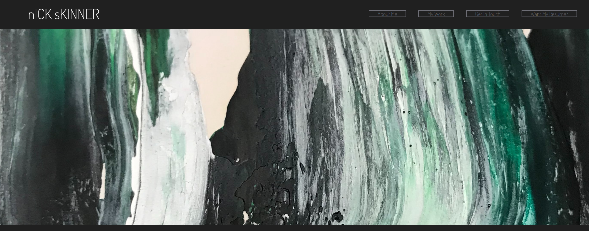

# Nick Skinner - A Portfolio

## Description
Here upon these pages I have displayed my work as a junior web designer, thus far.

## Operations
1. Scroll through the various sections
2. Download my Resume at the top or here (./assets/Resume Nicholas Skinner.pdf)

## Website URL
file:///C:/Users/Nick/homework02-portfolio-page/index.html

## Tech/Framework
Built with:
    *HTML
    *CSS
    *JavaScript

## Authors and Acknowledgment
* Nick Skinner

## Installation Instructions
1. Clone the github repo to your desktop: https://github.com/IGuessImNick/homework02-portfolio-page
2. Navigate to the top level of your directory.
3. Open js/index.html in your browser.

## Known Bugs

## License
Copyright [2021] [##Authors]

Licensed under the Apache License, Version 2.0 (the "License");
you may not use this file except in compliance with the License.
You may obtain a copy of the License at

    http://www.apache.org/licenses/LICENSE-2.0

Unless required by applicable law or agreed to in writing, software
distributed under the License is distributed on an "AS IS" BASIS,
WITHOUT WARRANTIES OR CONDITIONS OF ANY KIND, either express or implied.
See the License for the specific language governing permissions and
limitations under the License.